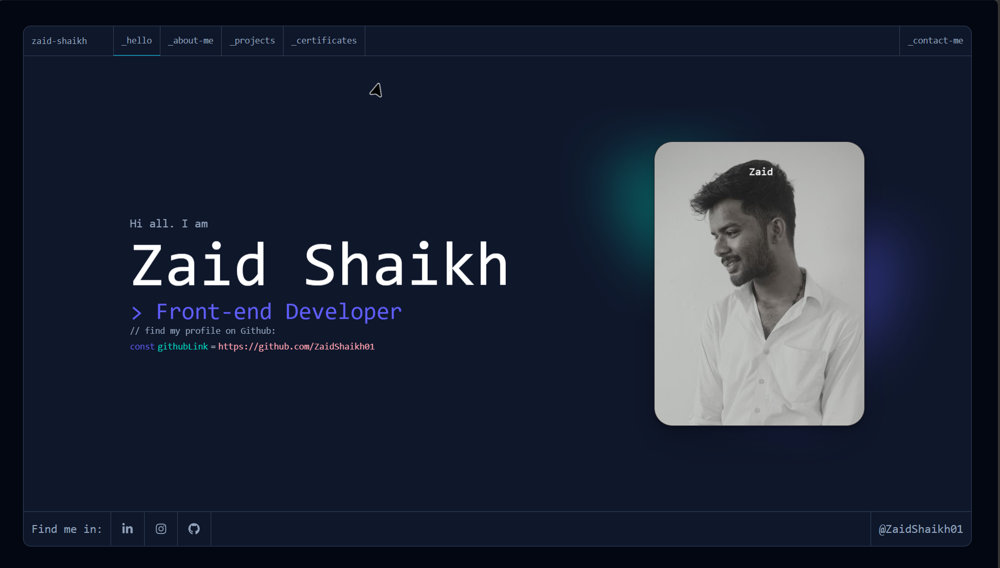
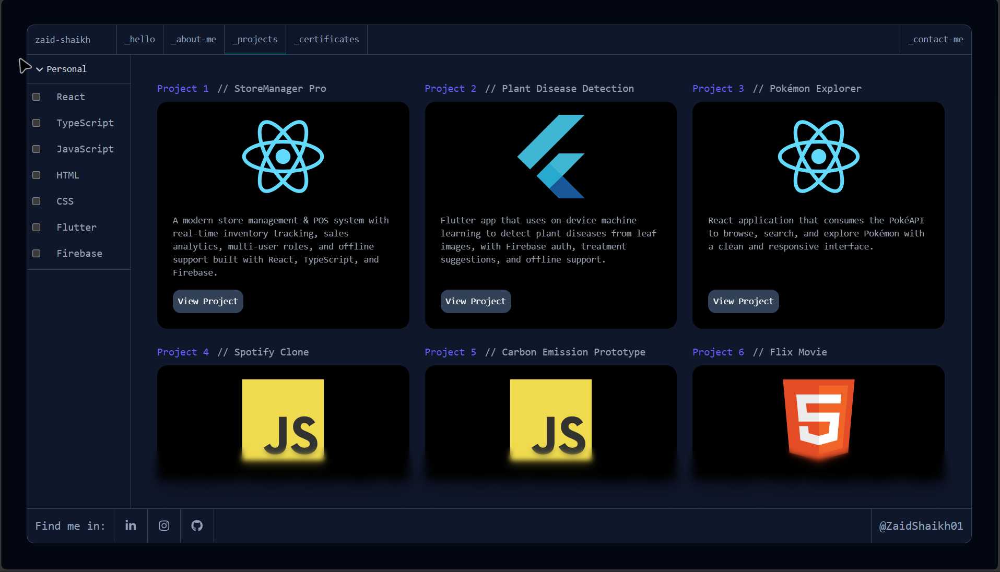
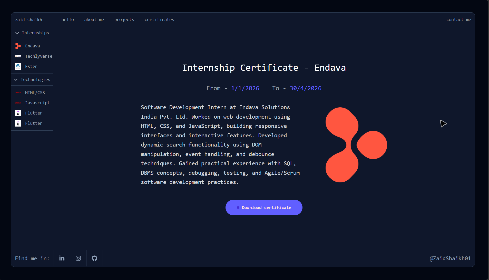
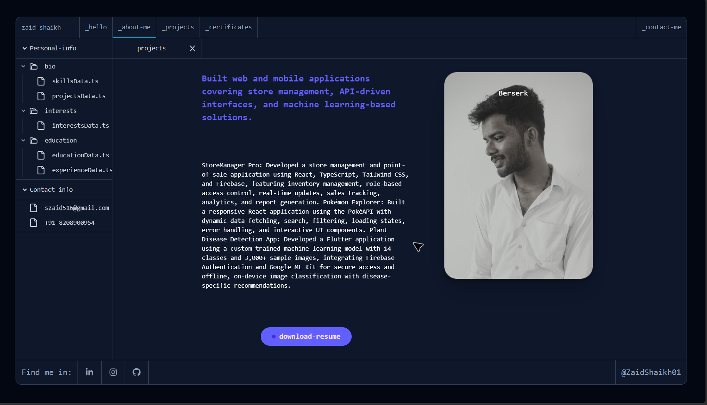
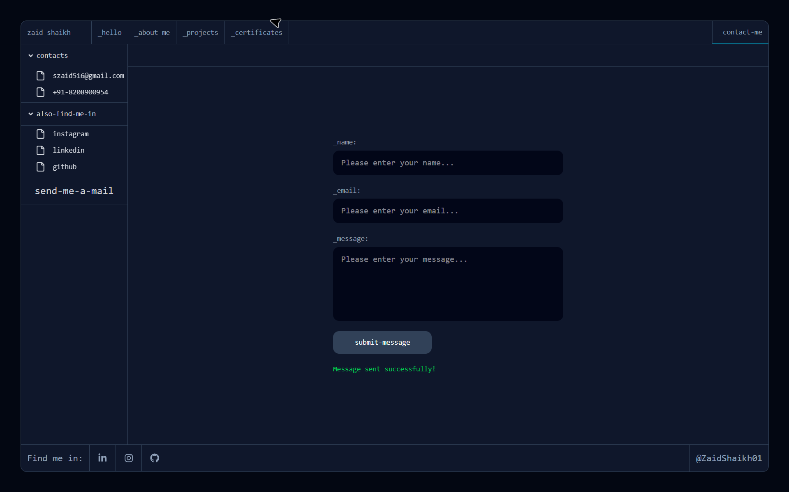
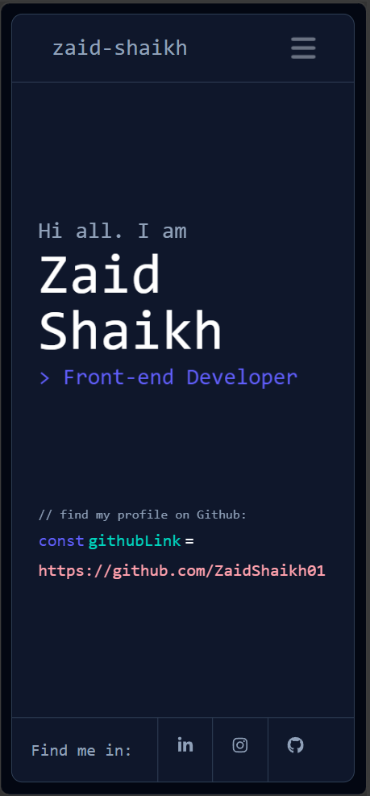
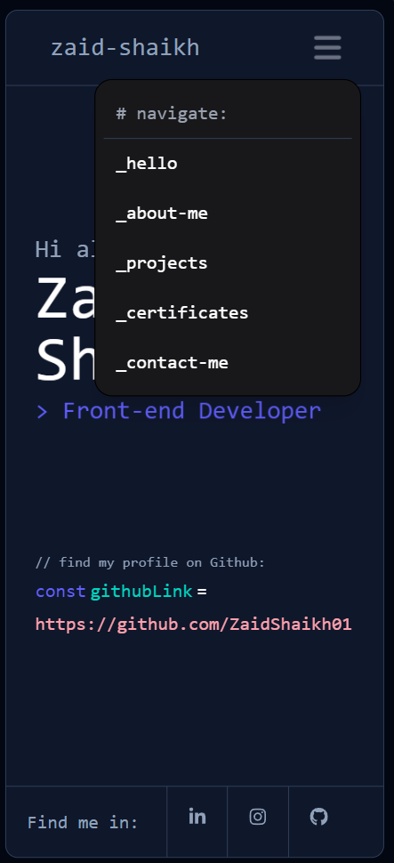

# Portfolio - Zaid Shaikh

A modern personal portfolio website built with React, TypeScript, and Tailwind CSS.

**Live Demo:** [https://portfolio-react-nu-sooty.vercel.app](https://portfolio-react-nu-sooty.vercel.app)

---

## About

This is my personal developer portfolio where I showcase my projects, skills, certifications, and experience.  
The design is inspired by a code editor theme to reflect my identity as a front-end developer.

---

## Features

- Responsive design (Mobile + Desktop)
- Projects showcase with GitHub links
- Certificates section
- Contact form (Formspree integration)
- Clean dark UI with modern animations
- Built with TypeScript for better type safety

---

## Tech Stack

- **Frontend:** React, TypeScript, React Router
- **Styling:** Tailwind CSS
- **Build Tool:** Vite
- **Deployment:** Vercel
- **Form Handling:** Formspree

---

## Sections

- **Hello** – Introduction
- **About Me** – Personal information and background
- **Projects** – Featured work with tech stack and links
- **Certificates** – Internships and technology certifications
- **Contact** – Get in touch form + social links

---

## Getting Started

### Prerequisites

- Node.js (v18 or higher)
- npm or yarn

### Installation

```bash
# Clone the repository
git clone https://github.com/ZaidShaikh01/Portfolio-React.git

# Go into the project folder
cd Portfolio-React

# Install dependencies
npm install

# Start the development server
npm run dev
```

The app will be available at `http://localhost:5173`

---

## Project Structure

```bash
Portfolio-React/
├── app/                  # Main application code
├── public/               # Static assets
├── package.json
├── tailwind.config.ts
├── tsconfig.json
└── vite.config.ts
```

---

## Screenshots

### Home



### Projects



### Certificates



### About Me



### Contact



### Mobile View




---

## Author

**Zaid Shaikh**

- GitHub: [ZaidShaikh01](https://github.com/ZaidShaikh01)
- Portfolio: [Live Site](https://portfolio-react-nu-sooty.vercel.app)
- LinkedIn: [ZaidShaikh01](https://www.linkedin.com/in/zaidshaikh01/)

---

## License

This project is open source and available under the [MIT License](LICENSE).
